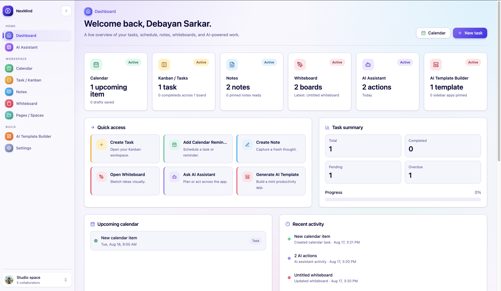

# NexMind

A productivity workspace that keeps notes, task boards, a calendar, and whiteboards in one app, with Gemini-powered helpers built into each one.

## Overview

Most productivity setups end up split across three or four tools. NexMind puts the common pieces in a single Next.js app: write notes, plan work on a kanban board, schedule things on a calendar, sketch on a whiteboard, and organise longer documents into spaces.

The AI parts are deliberately narrow. There's an assistant that can propose an action (create a board, add a task, draft a note) but always waits for you to confirm before it writes anything, plus inline text refinement in the editor and diagram generation on the whiteboard.

Auth is handled by Clerk, data lives in Neon Postgres via Drizzle, and Liveblocks provides presence and comments on shared boards.

## Screenshot



## Features

**Notes** — Tiptap editor with slash commands, word counts, pinning, categories, and a trash with restore. Select text and refine it with AI (rewrite, shorten, change tone).

**Boards** — Kanban with custom columns, priorities, due dates, JSON labels, and drag-to-reorder. Boards can be shared by email, and shared boards get live presence and comments through Liveblocks.

**Calendar** — Tasks and reminders with all-day support. Unscheduled items sit in a draft area until you drop them onto a date. Board tasks can sync into the calendar.

**Whiteboard** — Excalidraw canvas with scenes saved per user. Describe a diagram in words and Gemini generates the first version of the scene.

**Spaces & Pages** — Longer documents grouped into spaces, with favourites, archiving, comments, email sharing, and links between a page and a kanban task.

**AI Assistant** — A chat panel that reads a snapshot of your workspace and proposes one of nine action types (`create_kanban_board`, `create_calendar_item`, `update_note_content`, and so on). Every proposal requires explicit confirmation before it runs.

**AI Template Builder** — Describe a small tool and Gemini generates a working app definition you can use and optionally pin to the sidebar.

**Settings** — Theme, default calendar view, default task priority, auto-save, privacy mode, notification preferences, and per-feature AI toggles including which Gemini model to use.

**Plan limits** — Free accounts are capped (3 boards, 25 tasks, 10 notes, 2 spaces, 2 whiteboards, 50 AI actions per day). Clerk billing plans lift the caps.

## Tech Stack

- **Next.js 16** (App Router) and **React 19**
- **TypeScript**
- **Tailwind CSS v4** with shadcn-style components
- **Neon** serverless Postgres + **Drizzle ORM**
- **Clerk** for auth and billing plans
- **Google Gemini** via `@google/genai`
- **Liveblocks** for presence and comments
- **Tiptap** (notes and pages) and **Excalidraw** (whiteboard)

Data access is almost entirely through server actions — there are only two API routes, both for Liveblocks auth.

## Project Structure

```
app/
  ai-assistant/         Chat assistant, proposals + execution
  ai-template-builder/  Prompt-to-app generation
  calendar/             Calendar board
  dashboard/            Overview and activity
  kanban/               Boards, columns, tasks
  notes/                Tiptap notes
  spaces/               Spaces and pages
  whiteboard/           Excalidraw canvas
  settings/             User preferences
  api/liveblocks-auth/  Liveblocks room auth
  api/liveblocks-users/ User lookup for Liveblocks
components/             App shell, landing page, UI primitives
db/                     Drizzle schema and client
drizzle/                Generated SQL migrations
lib/                    Plan limits, user sync, Liveblocks helpers
proxy.ts                Clerk middleware
```

Each feature folder follows the same shape: `page.tsx` for the route, `actions.ts` for server actions, and a `*-workspace.tsx` client component for the UI.

## Setup

You'll need Node.js 20+ and accounts for [Neon](https://neon.tech), [Clerk](https://clerk.com), [Liveblocks](https://liveblocks.io), and [Google AI Studio](https://aistudio.google.com).

```bash
git clone <repo-url>
cd nexmind-ai-productivity-app-prod
npm install
cp .env.example .env
```

Fill in `.env`, then push the schema and start the dev server:

```bash
npm run db:push
npm run dev
```

The app runs at http://localhost:3000.

## Environment Variables

| Variable | Required | What it's for |
| --- | --- | --- |
| `NEXT_PUBLIC_APP_URL` | yes | Base URL, `http://localhost:3000` in dev |
| `DATABASE_URL` | yes | Neon Postgres connection string |
| `NEXT_PUBLIC_CLERK_PUBLISHABLE_KEY` | yes | Clerk publishable key |
| `CLERK_SECRET_KEY` | yes | Clerk secret key |
| `NEXT_PUBLIC_CLERK_SIGN_IN_URL` | yes | `/sign-in` |
| `NEXT_PUBLIC_CLERK_SIGN_UP_URL` | yes | `/sign-up` |
| `LIVEBLOCKS_SECRET_KEY` | yes | Presence and comments on shared boards |
| `GEMINI_API_KEY` | yes | All AI features |
| `GEMINI_MODEL` | no | Defaults to `gemini-3.1-flash-lite` |
| `CLERK_PRO_PLAN_KEY` | no | Reserved for billing; the plan check currently reads Clerk's `pro` plan slug directly |

Keep `.env` out of version control — only `.env.example` should be committed.

## Database

Drizzle schema lives in [db/schema.ts](db/schema.ts), with migrations generated into `drizzle/`.

```bash
npm run db:generate   # generate a migration from schema changes
npm run db:push       # push the schema to Neon
npm run db:studio     # browse data in Drizzle Studio
```

Tables cover users, calendar items, kanban boards/columns/tasks/shares, notes, whiteboards, generated apps, spaces/shares/pages, page-task links, page comments, user settings, categories, and daily AI usage. Clerk users are mirrored into the `users` table on sign-in, so everything keys off an internal user id rather than the Clerk id.

## Scripts

| Command | Description |
| --- | --- |
| `npm run dev` | Development server |
| `npm run build` | Production build |
| `npm run start` | Serve the production build |
| `npm run lint` | ESLint |
| `npm run db:generate` / `db:push` / `db:studio` | Drizzle tooling |

## Future Improvements

- Realtime collaboration on notes and pages, not just kanban boards
- Recurring calendar events
- Full-text search across notes, pages, and tasks
- Export notes and pages to Markdown or PDF
- Tests — there's no test setup yet

## License

[MIT](LICENSE)
